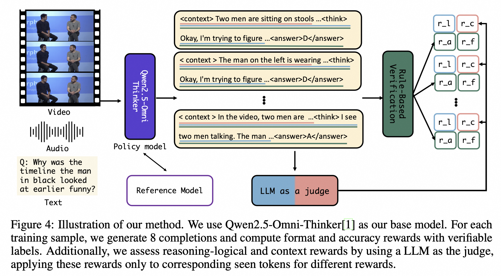
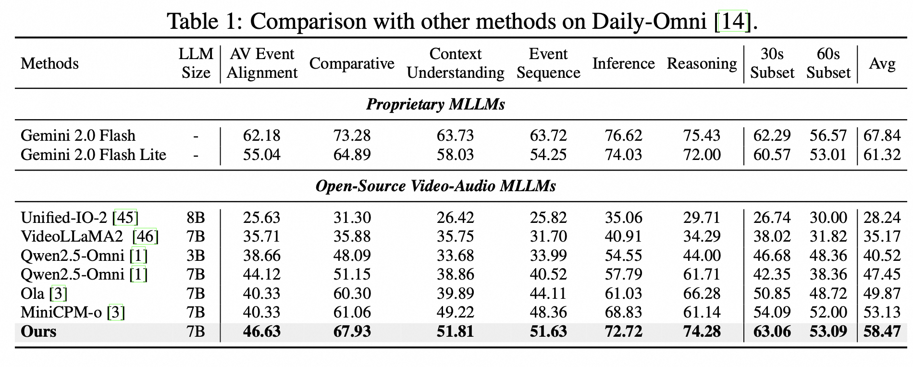
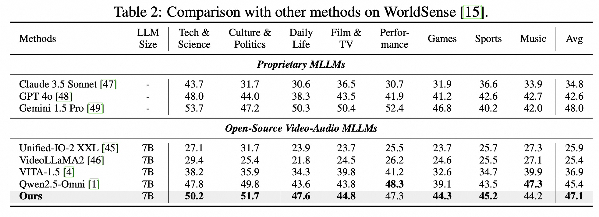
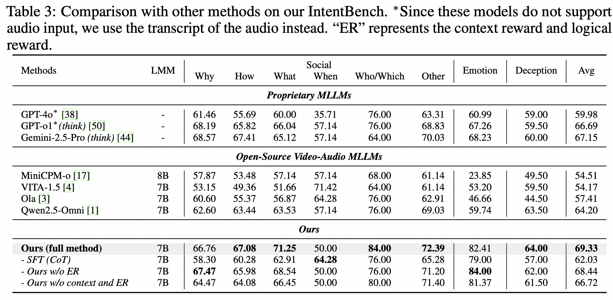

# HumanOmniV2: From Understanding to Omni-Modal Reasoning with Context
- Paper: [Arxiv](https://arxiv.org/abs/2506.21277)
- [IntentBench](https://huggingface.co/datasets/PhilipC/IntentBench)
- [Huggingface](https://huggingface.co/PhilipC/HumanOmniV2)
- [ModelScope](https://modelscope.cn/models/iic/humanomniv2)
## 👀 HumanOmniV2 Overview

<p align="center">
    
</p>


With the rapid evolution of multimodal large language models, the capacity to deeply understand and interpret human intentions has emerged as a critical capability, which demands detailed and thoughtful reasoning. In recent studies, Reinforcement Learning (RL) has demonstrated potential in enhancing the reasoning capabilities of Large Language Models (LLMs). Nonetheless, the challenges associated with adapting RL to multimodal data and formats remain largely unaddressed. In this paper, we identify two issues in existing multimodal reasoning models: insufficient global context understanding and shortcut problems. To tackle these issues, we emphasize the necessity for the model to reason with a clear understanding of the global context within multimodal inputs. This global context understanding can effectively prevent the model from overlooking key multimodal cues and ensure a thorough reasoning process. To ensure the accurate interpretation of multimodal context information and improve complex reasoning capability, we implement context reward and logical reward judged by a large language model, alongside format and accuracy rewards. Our proposed method demonstrates advanced performance across multiple omni-modal benchmarks compared to other open-source omni-modal models.

#### 🌟 Contributions in HumanOmniV2

1. We propose that models should summarize the context of multimodal inputs before engaging in the reasoning process. This approach aims to mitigate issues such as skipping crucial multimodal information and context understanding on multimodal inputs.

2. We curate a human-centric benchmark, IntentBench, for omni-modal evaluation, which requires simultaneously understanding video and audio, the global context, complex social relationships, and careful observation.

3. Our proposed HumanOmniV2 achieves the best performance across multiple omni-modal benchmarks compared to existing open-source omni-modal methods.

<p align="center">
    
</p>

## 🔥 News
We are hiring self-motivated Research Interns in China. Please feel free to contact Tech Manager via WeChat (id: weixihan1)

[2025/07/01] We release training and evaluation codes, model weights, IntentBench, and training data in huggingface🤗 and modelscope🤖

[2025/06/27] We release our paper and part of codes

## 📈 Experimental Results

#### 📍 Results

<p align="center">
    
</p>

<p align="center">
    
</p>

<p align="center">
    
</p>


## ⭐ Training detail and evaluation

### Evaluation
Download [IntentBench](https://huggingface.co/datasets/PhilipC/IntentBench), Dailyomni and WorldSence， and modify the video path in the code. 

```
export PYTHONPATH=./

python -m torch.distributed.launch --use_env  --nproc_per_node 8 --master-port 29502 --nnodes 1  eval/eval_humanomniv2.py \
    --model-path output/humanomniv2  \
    --file-name humanomniv2 \
    --dataset ib
```


### Training

#### Prepare

Download our long CoT data from [huggingface](https://huggingface.co/datasets/PhilipC/IntentTrain), [Video-R1](https://github.com/tulerfeng/Video-R1), [AVQA-R1-6K](https://huggingface.co/datasets/harryhsing/AVQA-R1-6K) or [OmniInstruct](https://huggingface.co/datasets/m-a-p/OmniInstruct)

Modify the config files .yaml for different stages in `data_config`, specify the json and video file paths


#### Training


```bash
# cold start
bash run_scripts/run_sft_qwenomni.sh

# Stage 1 RL
bash run_scripts/run_grpo_qwenomni_stage2.sh

# Stage 2 RL
bash run_scripts/run_grpo_qwenomni_stage3.sh
```

### ✒️ Citation

If you find our work helpful for your research, please consider citing our work.   

```bibtex
@article{yang2025humanomniv2,
  title={HumanOmniV2: From Understanding to Omni-Modal Reasoning with Context},
  author={Yang, Qize and Yao, Shimin and Chen, Weixuan and Fu, Shenghao and Bai, Detao and Zhao, Jiaxing and Sun, Boyuan and Yin, Bowen and Wei, Xihan and Zhou, Jingren},
  journal={arXiv preprint arXiv:2506.21277},
  year={2025}
}
```


## 👍 Acknowledgement
HumanOmniV2 is built with reference to the following outstanding works: [Video-R1](https://github.com/tulerfeng/Video-R1), [Qwen2.5-Omni](https://github.com/QwenLM/Qwen2.5-Omni), and many other awesome models and datasets! Thanks！


## 📜 License

- Our models and code are under the Apache License 2.0.
- But our self-collected videos are under [**CC BY-NC-SA 4.0**](https://creativecommons.org/licenses/by-nc-nd/4.0/) license.
