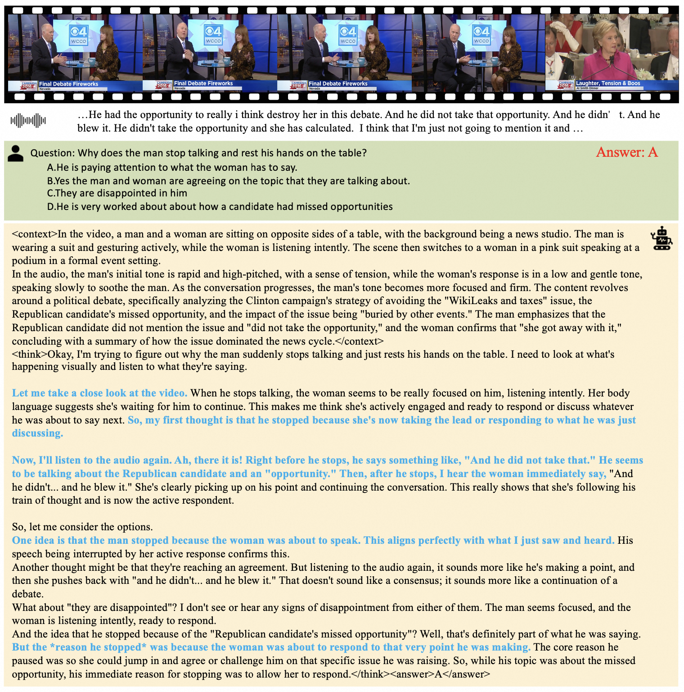
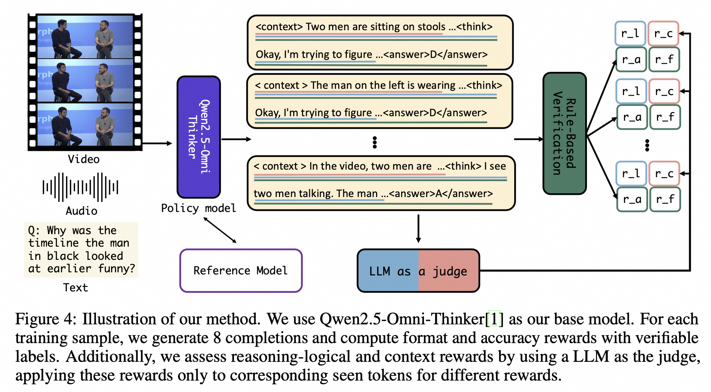
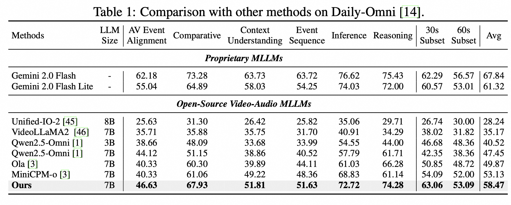
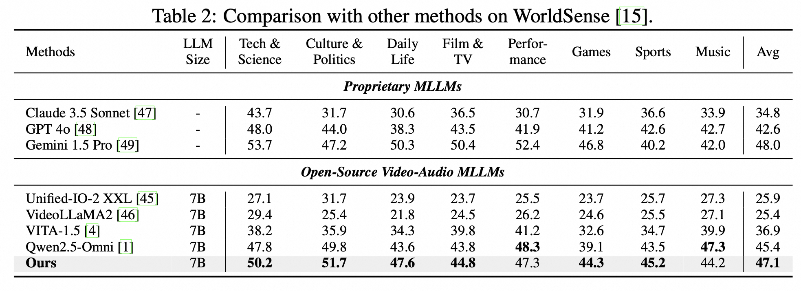
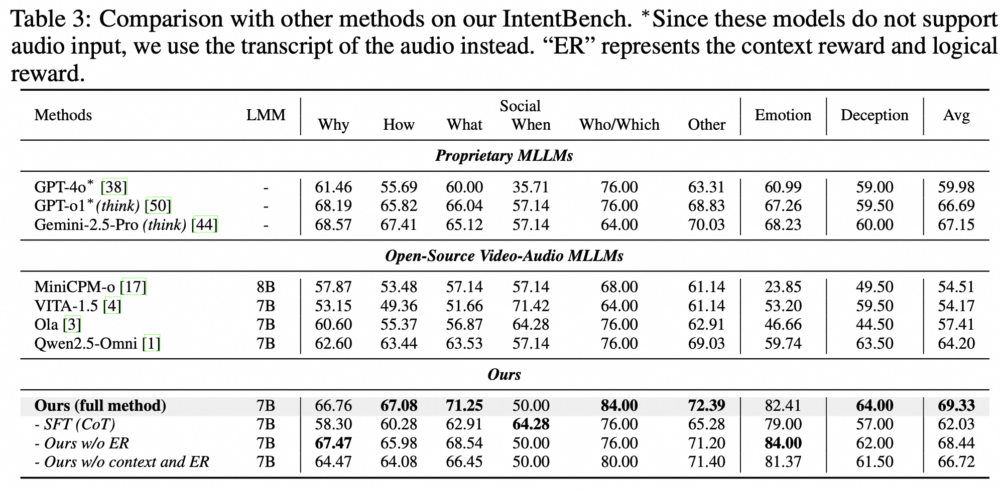

# HumanOmniV2: From Understanding to Omni-Modal Reasoning with Context
- Paper: [Arxiv](https://arxiv.org/abs/2506.21277)
- IntentBench (coming soon)
- Huggingface (coming soon)
- ModelScope (coming soon)
## 👀 HumanOmniV2 Overview

    

With the rapid evolution of multimodal large language models, the capacity to deeply understand and interpret human intentions has emerged as a critical capability, which demands detailed and thoughtful reasoning. In recent studies, Reinforcement Learning (RL) has demonstrated potential in enhancing the reasoning capabilities of Large Language Models (LLMs). Nonetheless, the challenges associated with adapting RL to multimodal data and formats remain largely unaddressed. In this paper, we identify two issues in existing multimodal reasoning models: insufficient global context understanding and shortcut problems. To tackle these issues, we emphasize the necessity for the model to reason with a clear understanding of the global context within multimodal inputs. This global context understanding can effectively prevent the model from overlooking key multimodal cues and ensure a thorough reasoning process. To ensure the accurate interpretation of multimodal context information and improve complex reasoning capability, we implement context reward and logical reward judged by a large language model, alongside format and accuracy rewards. Our proposed method demonstrates advanced performance across multiple omni-modal benchmarks compared to other open-source omni-modal models.

#### 🌟 Contributions in HumanOmniV2

1. We propose that models should summarize the context of multimodal inputs before engaging in the reasoning process. This approach aims to mitigate issues such as skipping crucial multimodal information and context understanding on multimodal inputs.

2. We curate a human-centric benchmark, IntentBench, for omni-modal evaluation, which requires simultaneously understanding video and audio, the global context, complex social relationships, and careful observation.

3. Our proposed HumanOmniV2 achieves the best performance across multiple omni-modal benchmarks compared to existing open-source omni-modal methods.

    

## 📈 Experimental Results

#### 📍 Results

    

    

    

## ⭐ Training detail and evaluation (comeing soon)

## 📜 License

- Our models and code are under the Apache License 2.0.
- But our self-collected videos are under [**CC BY-NC-SA 4.0**](https://creativecommons.org/licenses/by-nc-nd/4.0/) license.
